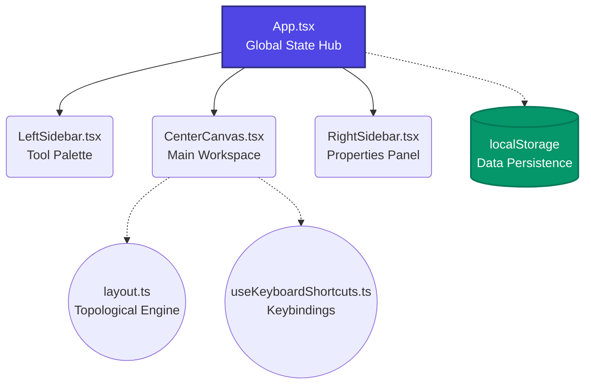
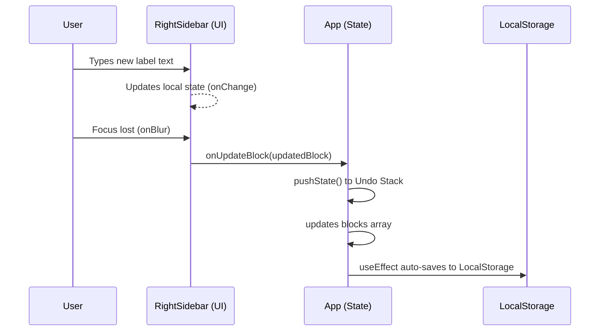

# FlowCraft Architecture

FlowCraft is a high-performance, web-based flowchart builder. It features a React-driven dynamic canvas, an intuitive drag-and-drop workspace, automatic topological layout processing, and persistent workspaces stored in the browser's `localStorage`. Note: `localStorage` data is **not encrypted** and should not be treated as a security boundary — it is intended solely for user convenience across browser sessions.

## Core Technologies

- **Frontend Framework**: React 19 + TypeScript
- **Build Tool**: Vite
- **Styling**: Tailwind CSS v4
- **Icons**: Lucide React
- **Exporting**: html-to-image (PNG/SVG), jsPDF (PDF), pptxgenjs (PPTX)

## System Overview

The system is organized into a modular component tree centered around a flexible layout engine.

### 1. State Management (`App.tsx`)
The `App` component acts as the global state container, managing:
- `blocks`: The master list of nodes (terminators, processes, decisions, IO).
- `workspaces`: Managing multiple saved diagrams (auto-persisted in `localStorage`).
- **Undo/Redo History Stack**: Tracks graph state changes (including label edits, connection updates, and block additions/deletions) for seamless reversal via `pushState()` (`past` and `future` state arrays).
- **Theme Settings**: Persisted dark mode settings and auto-detection.

### 2. Layout Engine (`utils/layout.ts`)
FlowCraft avoids using bulky external graph libraries by implementing a custom deterministic layout engine.
- Calculates node depths and relative positions.
- Dynamically computes SVG paths connecting `targetId`, `yesTargetId`, and `noTargetId`.
- Resolves loopback edges and overlapping connections seamlessly.
- Supports toggling between `vertical` (top-down) and `horizontal` (left-right) layout directions.

### 3. Component Architecture

* `LeftSidebar.tsx`: The tool palette. Responsible for adding new blocks and managing workspace files (export/import).
* `CenterCanvas.tsx`: The primary interaction zone. Responsible for rendering the nodes, capturing pointer events for panning and zooming, rendering SVG connection paths, and managing the export drop-down menus.
* `RightSidebar.tsx`: The properties panel. Bound to the `selectedBlockId`, allowing users to rename labels, alter connection targets, and delete nodes.

## Data Flow & Persistence

State is saved to the browser's `localStorage` under the key `flowforge_workspaces`. Changes are automatically synchronized on every graph mutation to prevent accidental data loss.

**Legacy migration:** If `flowforge_workspaces` is absent (first load on an older installation), the app reads and validates the legacy `flowforge_save` key, migrates its contents into a default "Form-Flow Sandbox" workspace, and writes the result to `flowforge_workspaces` for all future reads.

## Future Enhancements
- Real-time multiplayer collaboration (WebSockets / WebRTC)
- Advanced bezier curve auto-routing
- Extensible plugin system for custom block shapes
