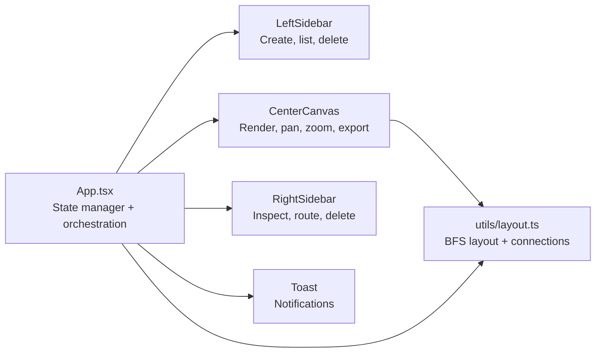
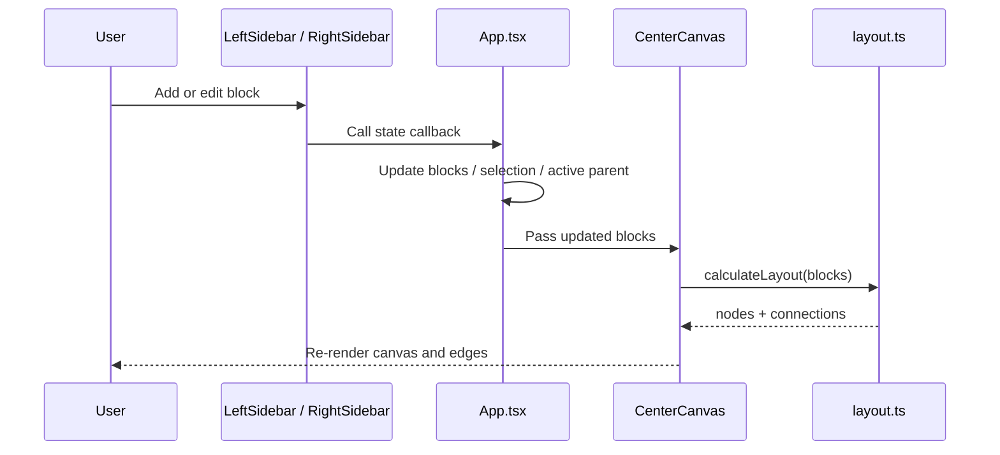

# FlowCraft Architecture

This document explains how FlowCraft is structured internally, how state moves through the app, and how the auto-layout engine turns a block graph into canvas coordinates.

## System Overview

FlowCraft is organized as a small, state-driven React application. `App.tsx` owns the canonical workflow graph and acts as the coordination layer between the three major UI regions:

- Left sidebar for block creation and list management
- Center canvas for rendering, navigation, save/load, and export
- Right sidebar for inspecting and editing the selected block
- Toast system for transient user feedback

### High-Level Hierarchy



## Core Responsibilities

### `App.tsx`: State Manager and Event Router

`App.tsx` is the root owner of application state. It keeps the source of truth for:

- `blocks`: the flow graph as an array of `Block` objects
- `selectedBlockId`: the currently inspected block
- `activeParentId`: the block that new blocks should attach to when chaining
- `toasts`: transient UI messages

It also owns the main workflow actions:

- add a block
- update a block
- delete a block
- continue a chain from the selected block
- save to Local Storage
- load from Local Storage
- clear the canvas
- seed the demo flowchart
- emit toast messages

`App.tsx` does not calculate positions directly. Instead, it passes `blocks` into the layout engine and passes callbacks into the child components.

### `utils/layout.ts`: Layout Engine and Connection Builder

`layout.ts` is the geometric layer of the app. It converts the logical graph of blocks into:

- `CanvasNode` positions for the rendered nodes
- SVG connection paths for edges and labels

It currently uses a breadth-first style placement strategy that prefers parent-first ordering, resolves branching explicitly, and falls back safely when the graph is disconnected or cyclic.

### `LeftSidebar.tsx`: Block Creation and List Management

The left sidebar is the creation surface. It lets users:

- choose a block type
- enter a label
- set branch labels for decision nodes
- append the block to the graph
- browse existing blocks
- select a block
- delete a block

When `activeParentId` is set, the sidebar shows the chaining context and helps the user continue a sequence from the chosen parent.

### `CenterCanvas.tsx`: Visual Workspace

The center canvas renders the computed layout and handles viewport interaction:

- layout calculation through `calculateLayout(blocks)`
- edge generation through `calculateConnections(nodes)`
- pan and zoom state
- save/load/export actions
- empty-canvas bootstrap actions

This component is intentionally read-heavy. It consumes application state and derives a canvas view from it, but it does not own the underlying workflow graph.

### `RightSidebar.tsx`: Inspector and Routing Editor

The right sidebar edits the currently selected block. It allows users to:

- rename the block
- change standard next targets
- set decision `Yes` and `No` targets
- delete the selected block
- trigger a “select and continue” workflow

This panel is the main place where graph edges are edited after a block is created.

### `Toast.tsx`: Feedback Layer

Toast messages are emitted by the state manager and rendered as ephemeral notifications. They provide low-friction feedback for actions such as add, delete, save, load, and export.

## Data Model

The workflow graph is stored as an array of `Block` objects.

```ts
type ShapeType = 'terminator' | 'process' | 'decision' | 'io';

interface Block {
  id: string;
  type: ShapeType;
  label: string;
  targetId?: string;
  yesLabel?: string;
  noLabel?: string;
  yesTargetId?: string;
  noTargetId?: string;
}
```

Key conventions:

- Standard nodes use `targetId`.
- Decision nodes use `yesTargetId` and `noTargetId`.
- Edges are stored by ID reference, not by embedded child objects.
- A missing target represents a disconnected edge.

This shape keeps serialization simple for Local Storage and export payloads.

## Runtime Data Flow

The app follows a unidirectional state flow:



The important rule is that user interactions mutate state in `App.tsx`, and the canvas is rebuilt from that state on every render.

## Layout Mapping Algorithm

The current auto-layout is not a generic force-directed solver. It is a deterministic graph-to-grid mapper optimized for flowchart structures.

### 1. Build incoming-edge metadata

The algorithm first scans every block and builds two lookup tables:

- `incomingMap`: number of incoming references for each block
- `parentsMap`: list of parent IDs for each block

For decision nodes, both `yesTargetId` and `noTargetId` contribute incoming edges. For standard nodes, only `targetId` contributes.

### 2. Pick a root candidate

The layout tries to start from a root node:

- first preference: any node with zero incoming edges
- fallback: the node with the fewest incoming edges
- final fallback: the first block in the array

This keeps the diagram anchored even when the graph is partially connected.

### 3. Place blocks incrementally

The algorithm maintains:

- `layoutMap`: block ID to grid position `{ row, col }`
- `occupied`: a set of used grid cells
- `pending`: blocks that have not been placed yet

It repeatedly tries to place any block whose parents are already placed. If nothing can be placed, it force-places the next pending block to break cycles or disconnected deadlocks.

### 4. Apply graph-aware placement rules

Placement depends on the parent structure:

- Root node: place at `(0, 0)` or the next free cell in that column
- Single parent, standard node: place directly below the parent at `(parent.row + 1, parent.col)`
- Single parent, decision node branch:
  - `Yes` branch: `(parent.row + 1, parent.col + 1)`
  - `No` branch: `(parent.row + 1, parent.col - 1)`
- Multiple parents: treat as a rejoin point
  - row = max parent row + 1
  - col = average of parent columns, rounded to the nearest integer

If the target grid cell is already occupied, the algorithm shifts the row downward until an open slot is found.

### 5. Handle disconnected leftovers

After the main pass, any unplaced block is placed into the first free cell in column 0. This guarantees every block receives coordinates.

### 6. Convert grid positions to canvas coordinates

The final positions are converted from grid space to absolute canvas coordinates with fixed spacing constants:

```text
x = 600 + col * COLUMN_WIDTH
y = 40 + row * ROW_HEIGHT
```

Current layout constants are:

- `NODE_WIDTH = 180`
- `NODE_HEIGHT = 72`
- `COLUMN_WIDTH = 200`
- `ROW_HEIGHT = 150`
- `DIAMOND_SIZE = 92`
- `DIAMOND_HALF_DIAG = 65`

The canvas uses these values to keep node spacing readable and to leave room for arrow routing.

## Connection Path Generation

`calculateConnections(nodes)` turns the positioned nodes into edge metadata for rendering.

The connection builder:

- identifies shared targets that have multiple incoming links
- creates a connection for each outgoing edge
- attaches labels such as `Yes` and `No`
- computes label placement and routing hints for the canvas and export code

For decision nodes, the yes/no branches are created independently so each branch can be routed and labeled separately.

## Canvas Viewport Model

The center canvas uses a layered viewport model:

- the layout engine places nodes in world space
- the canvas adds pan offsets
- zoom is applied as a scale factor bounded between `0.25` and `3`

This separation keeps layout deterministic while allowing the user to explore large diagrams without re-running the graph placement algorithm.

## Interaction Patterns

### Add Block

1. User fills the left sidebar form.
2. `App.tsx` creates a new block ID and updates the graph.
3. If `activeParentId` is set, the new block is attached to the selected parent or inserted between existing nodes when needed.
4. The new block becomes the selected block.
5. The canvas re-renders from the updated graph.

### Edit Block Routing

1. User selects a block.
2. `RightSidebar.tsx` shows the block properties.
3. User changes label or targets.
4. `App.tsx` replaces the matching block in state.
5. `layout.ts` recalculates positions and connections.

### Delete Block

1. User deletes a block from either sidebar.
2. `App.tsx` removes the block from `blocks`.
3. Any references to that block are cleared from other nodes.
4. The selection and active-parent state are reset if needed.

## Contributor Notes

- Keep the `Block` schema ID-based and serializable.
- Update both the layout engine and the inspector UI when adding a new node type or edge type.
- Preserve the root-to-leaf deterministic placement model unless there is a strong reason to replace it.
- If you change spacing constants, check node collisions, arrow routing, and export output together.

## Practical Mental Model

Think of the app in three layers:

1. `App.tsx` owns the graph.
2. `layout.ts` converts the graph into positions and paths.
3. The UI components render and edit that derived view.

That separation is the main reason FlowCraft stays predictable as the diagram grows.